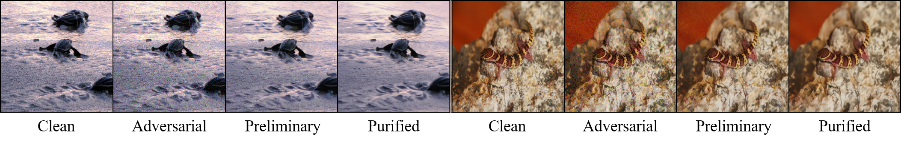
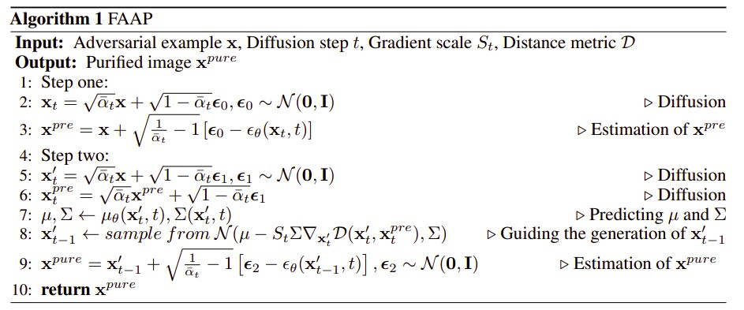

# Fast and Accurate Adversarial Purification with Twice One-step Denoising

This repository is the official implementation of Fast and Accurate Adversarial Purification with Twice One-step Denoising




## Requirements

To install requirements:

```setup
pip install -r requirements.txt
```

If you want to enable mixed-precision computation using the `apex` library, please install the `apex` library.

```
git clone https://github.com/NVIDIA/apex
cd apex
pip3 install -v --no-cache-dir ./
```

(Maybe) Solution for 'IndexError: tuple index out of range':
https://github.com/NVIDIA/apex/issues/694#issuecomment-918833904


## Pre-trained Models

You can download pretrained models here:
- DDPM on ImageNet https://github.com/openai/guided-diffusion
  - checkpoint [256x256_diffusion_uncond.pt](https://openaipublic.blob.core.windows.net/diffusion/jul-2021/256x256_diffusion_uncond.pt)
- DDPM on Cifar10 https://github.com/openai/improved-diffusion
  - checkpoint [cifar10_uncond_50M_500K.pt](https://openaipublic.blob.core.windows.net/diffusion/march-2021/cifar10_uncond_50M_500K.pt)


## Evaluation

To evaluate my model on Cifar10, run:

```
python3 -m torch.distributed.launch --nproc_per_node=4 run.py --mode pgd --T 350 --scale 100000
```

To evaluate my model on ImageNet, run:

```
python3 -m torch.distributed.launch --nproc_per_node=4 run.py --mode pgd --T 80 --scale 1500 --model resnet152
```

## Contributing
This implementation is based on / inspired by:

- https://github.com/ethz-privsec/diffusion_denoised_smoothing
- https://github.com/NVlabs/DiffPure
- https://github.com/openai/guided-diffusion
- https://github.com/openai/improved-diffusion
- https://github.com/point0bar1/ebm-defense